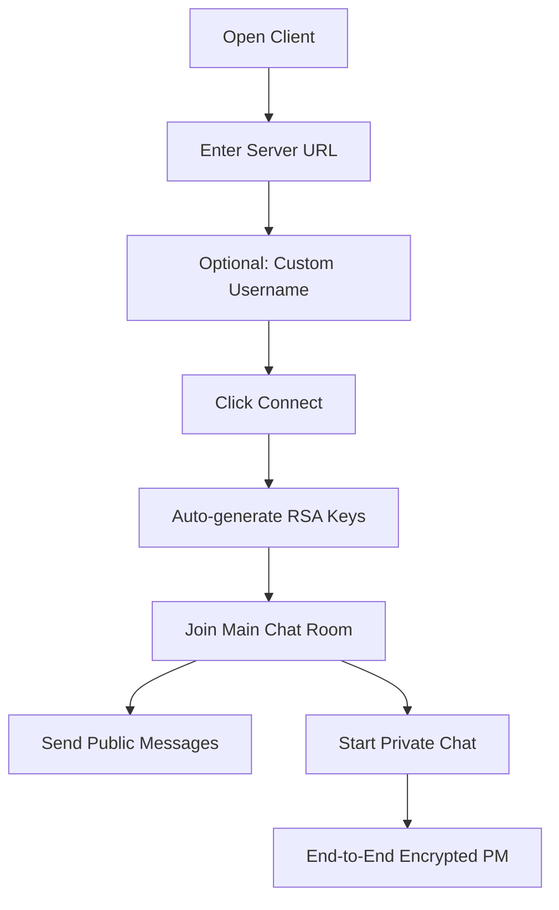
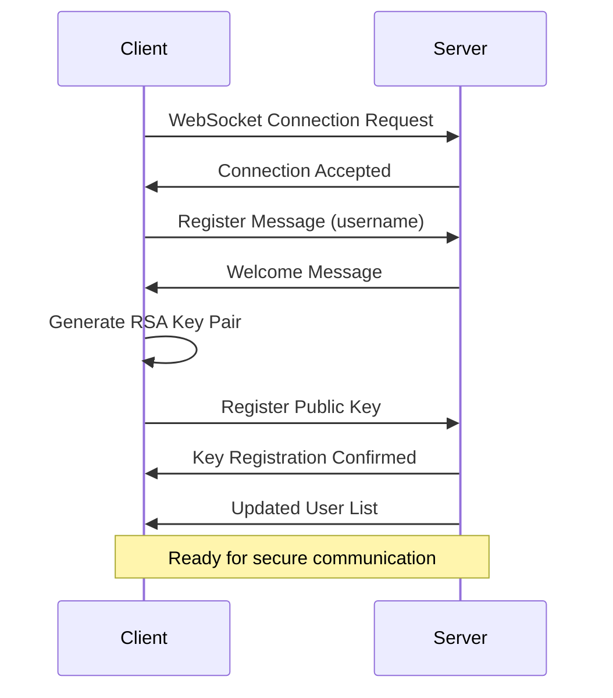
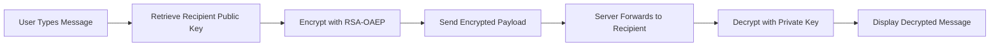

# xsukax Chatroom E2E System

A secure, real-time chat application featuring end-to-end encryption for private messages, robust moderation tools, and zero-persistence architecture designed for privacy-conscious communication.

## Project Overview

The xsukax Chat System is a WebSocket-based real-time messaging platform that prioritizes user privacy and security. Built with Python and vanilla JavaScript, it provides both public chat rooms and encrypted private messaging capabilities without storing any conversation history. The system features automatic username generation, comprehensive admin controls, and built-in flood protection mechanisms.

**Core Architecture:**
- **Server**: Python-based WebSocket server using the `websockets` library
- **Client**: Single-page HTML application with vanilla JavaScript
- **Encryption**: Client-side RSA-OAEP key generation and end-to-end encryption
- **Storage**: Zero-persistence design with no message logging or history retention

## Security and Privacy Benefits

### End-to-End Encryption
- **RSA-OAEP 2048-bit encryption** for all private messages
- **Client-side key generation** ensures private keys never leave the user's device
- **Perfect Forward Secrecy** through session-based key pairs
- **Zero server-side decryption capability** for private communications

### Privacy Protection
- **No message persistence** - conversations are never stored on the server
- **No conversation logging** - complete ephemeral messaging
- **Anonymous connectivity** - no email or personal information required
- **Auto-generated usernames** prevent identity correlation
- **Memory-only state** - all data exists only in RAM during sessions

### Security Measures
- **Automatic admin password rotation** every hour
- **IP-based banning system** with persistent ban lists
- **Flood protection** limiting users to 30 messages per minute
- **Connection heartbeat monitoring** prevents zombie connections
- **Input validation and sanitization** prevents injection attacks
- **WebSocket security** with proper origin checking and rate limiting

### Trust and Transparency
- **Open source architecture** allows independent security audits
- **No external dependencies** for the client application
- **Minimal attack surface** with lightweight, focused codebase
- **Clear separation** between public and private communication channels

## Features and Advantages

### Core Messaging Features
- **Real-time communication** with sub-second message delivery
- **Dual-channel architecture** supporting both public rooms and private messaging
- **Tabbed interface** for managing multiple private conversations
- **Auto-reconnection** with exponential backoff for connection stability
- **Cross-platform compatibility** through web browser support

### Administrative Capabilities
- **Dynamic admin authentication** with hourly password rotation
- **User management tools** including kick and ban functionality
- **Real-time user monitoring** with connection status and IP tracking
- **Granular permissions** with admin-exempt flood protection
- **Comprehensive user information** display for moderation decisions

### User Experience Enhancements
- **Responsive design** optimized for desktop and mobile devices
- **Intuitive interface** with clear visual indicators for message types
- **Notification system** for new private messages in background tabs
- **Context menus** for quick user interactions and admin actions
- **Status indicators** showing connection state and encryption status

### Technical Advantages
- **Lightweight deployment** requiring only Python 3.11+ and a web browser
- **Scalable architecture** supporting concurrent connections
- **Resource efficient** with minimal memory and CPU footprint
- **Framework-free client** eliminating JavaScript framework dependencies
- **Standards-compliant** WebSocket implementation for broad compatibility

## Installation Instructions

### Prerequisites
- Python 3.11 or higher
- Modern web browser with WebCrypto API support
- Network connectivity for WebSocket communications

### Server Setup

1. **Clone the repository:**
   ```bash
   git clone https://github.com/xsukax/xsukax-Chatroom-E2E-System.git
   cd xsukax-Chatroom-E2E-System
   ```

2. **Install Python dependencies:**
   ```bash
   pip3 install websockets
   ```

3. **Run the chat server:**
   ```bash
   python3 chat_server.py
   ```

4. **Note the admin password:**
   The server will display the initial admin password on startup and generate a new one every hour.

### Client Access

1. **Open the client application:**
   Open `chat_client.html` in any modern web browser, or serve it through a web server.

2. **Configure connection:**
   - Default Testing server URL: `ws://localhost:3333`
   - Default Demo server URL: `wss://chat.xsukax.net`
   - For remote servers, update the URL accordingly
   - Optionally specify a custom username, or leave blank for auto-generation

3. **Connect and start chatting:**
   Click "Connect" to join the chat system and begin secure communication.

### Deployment Considerations

**For Production Use:**
- Configure firewall rules to allow WebSocket connections on port 3333
- Consider using a reverse proxy (nginx, Apache) for SSL/TLS termination
- Implement monitoring for server health and connection metrics
- Adjust flood protection limits based on expected usage patterns

**For Development:**
- Server runs on `0.0.0.0:3333` by default, accessible from any network interface
- Admin passwords are saved to `admin.txt` for development convenience
- Ban lists are persisted in `banned.txt` for testing moderation features

## Usage Guide

### Basic Chat Operations



### Connection and Authentication Flow



### Private Message Encryption Process



### Administrative Functions

**Becoming an Admin:**
1. Click the "Admin" button in the interface
2. Enter the current admin password (displayed in server console)
3. Gain access to moderation tools and user management

**Admin Commands:**
- `/userinfo <username>` - Display detailed user information
- `/kick <username>` - Remove user from chat temporarily
- `/ban <username>` - Permanently ban user by IP address
- `/changeuname <new_username>` - Change your username

**User Commands:**
- `/help` - Display available commands
- `/changeuname <new_username>` - Change your username

### Security Best Practices

**For Users:**
- Verify encryption indicators (🔒) appear on private messages
- Be cautious when sharing sensitive information even in encrypted channels
- Log out properly to clear local encryption keys
- Use unique usernames that don't reveal personal information

**For Administrators:**
- Regularly monitor the admin password rotation in server logs
- Maintain secure access to the server console for password retrieval
- Review ban lists periodically to ensure appropriate moderation
- Monitor flood protection logs for potential abuse patterns

### Troubleshooting Common Issues

**Connection Problems:**
- Verify WebSocket URL format (ws:// or wss://)
- Check firewall settings on both client and server
- Ensure server is running and accessible on specified port

**Encryption Issues:**
- Confirm browser supports WebCrypto API (all modern browsers)
- Verify public key exchange completed successfully
- Check for JavaScript errors in browser developer console

**Performance Optimization:**
- Monitor server memory usage during high concurrent user loads
- Adjust heartbeat intervals for network conditions
- Consider connection pooling for large-scale deployments

## Licensing Information

This project is licensed under the **GNU General Public License v3.0** (GPL-3.0).

### What This Means

**For Users:**
- You are free to use, modify, and distribute this software
- You have access to the complete source code
- No warranty is provided, but you have the right to fix issues yourself
- You can use this software for any purpose, including commercial use

**For Contributors:**
- Any modifications or derivative works must also be licensed under GPL-3.0
- You must provide source code for any distributed modifications
- You cannot impose additional restrictions on the software
- Patent rights are granted for the software but cannot be used defensively

**For Distributors:**
- You must include the full license text with any distribution
- Source code must be made available to recipients
- You cannot charge for the software itself, only for distribution or support services
- All derivative works must maintain GPL-3.0 licensing

The GPL-3.0 license ensures that this chat system remains free and open source, fostering community development while protecting user freedom. It prevents proprietary forks while encouraging collaborative improvement and security auditing.

For the complete license text, see the [LICENSE](LICENSE) file in this repository or visit [https://www.gnu.org/licenses/gpl-3.0.html](https://www.gnu.org/licenses/gpl-3.0.html).

---

**Contributing:** Pull requests and issue reports are welcome. Please ensure all contributions maintain the project's focus on security, privacy, and simplicity.

**Security Reporting:** For security vulnerabilities, please open a GitHub issue with detailed reproduction steps.
