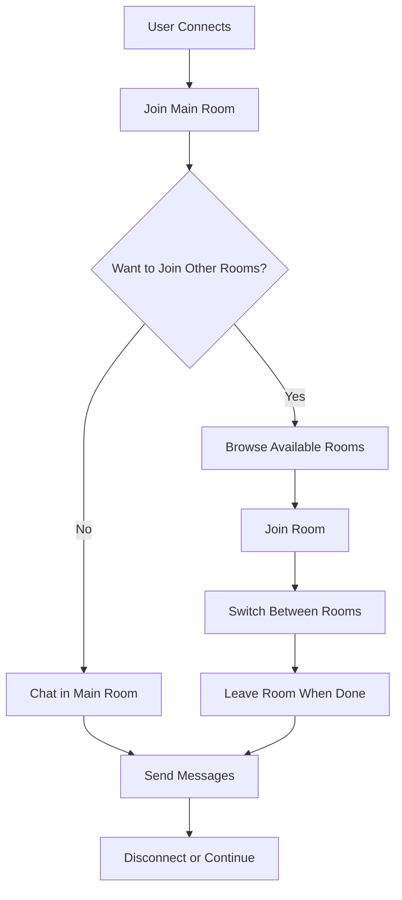
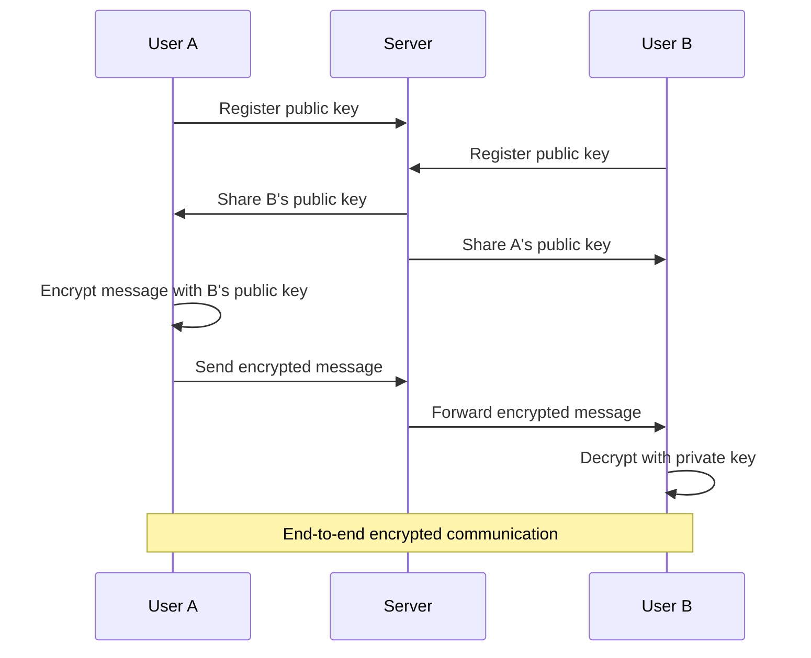
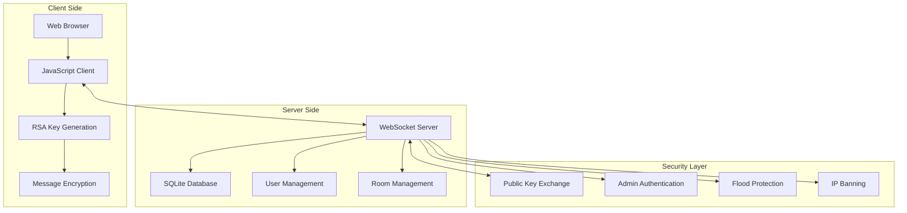

# xsukax Chatroom E2E System

A secure, real-time WebSocket-based chat system featuring end-to-end encryption for private messages, multi-room support, and comprehensive administrative controls. Built with privacy and security as core principles.


## Project Overview

The xsukax Chatroom E2E System is a modern web-based chat application that prioritizes user privacy and security. It implements client-side RSA encryption for private messages, ensuring that sensitive communications remain confidential even from server administrators. The system supports multiple chat rooms, real-time messaging, and robust administrative features while maintaining a clean, responsive interface that works across desktop and mobile devices.

The architecture consists of a Python WebSocket server with SQLite database storage and a browser-based client featuring modern cryptographic capabilities. The system is designed for both public chat rooms and secure private communications, making it suitable for various use cases from casual community chat to secure business communications.

## Security and Privacy Benefits

### End-to-End Encryption
- **RSA-OAEP Encryption**: Private messages are encrypted client-side using 2048-bit RSA keys with OAEP padding
- **Key Exchange**: Public keys are exchanged through the server but private keys never leave the client
- **Forward Secrecy**: Each client generates fresh keypairs for enhanced security
- **Encryption Indicators**: Visual indicators show when encryption is available and active

### Privacy by Design
- **No Message Storage**: Messages are not permanently stored on the server
- **Ephemeral Communications**: Chat history exists only in client memory during the session
- **IP Protection**: Only administrators can view IP addresses for moderation purposes
- **Anonymous Usernames**: Auto-generated usernames (xsukax0001, etc.) provide privacy by default

### Administrative Security
- **Rotating Admin Passwords**: Administrative passwords automatically rotate every hour
- **Secure Authentication**: Admin credentials are stored locally and regenerated frequently
- **Granular Permissions**: Clear separation between user and administrator capabilities
- **Audit Trail**: Room creation and management actions are logged with timestamps

### Network Security
- **WebSocket Security**: Supports both WS and WSS (encrypted) connections
- **Flood Protection**: Rate limiting (30 messages/minute) prevents spam and abuse
- **IP-based Banning**: Persistent IP blocking for problematic users
- **Connection Stability**: Heartbeat mechanism ensures reliable connections

## Features and Advantages

### Core Messaging Features
- **Real-time Communication**: Instant message delivery using WebSocket technology
- **Multi-room Support**: Create and join multiple chat rooms with isolated conversations
- **Private Messaging**: Secure one-on-one conversations with end-to-end encryption
- **User Presence**: Real-time user lists showing who's online in each room
- **Cross-platform**: Works on desktop browsers, tablets, and mobile devices

### User Experience
- **Intuitive Interface**: Clean, modern design with tab-based room navigation
- **Responsive Design**: Optimized for both desktop and mobile usage
- **Visual Feedback**: Clear indicators for encryption status, admin privileges, and notifications
- **Context Menus**: Right-click actions for administrative functions
- **Accessibility**: Keyboard navigation and semantic HTML structure

### Administrative Controls
- **User Management**: View detailed user information including IP addresses and join times
- **Moderation Tools**: Kick and ban users with immediate effect
- **Room Administration**: Create, delete, and manage chat rooms
- **Real-time Monitoring**: Live user lists and activity tracking
- **Flexible Permissions**: Admin-only functions clearly separated from user features

### Technical Advantages
- **Lightweight**: Minimal dependencies and efficient resource usage
- **Scalable Architecture**: WebSocket-based design supports many concurrent users
- **Database Persistence**: SQLite storage for room management and user tracking
- **Error Handling**: Comprehensive error handling and graceful degradation
- **Modern Standards**: Uses contemporary web APIs and security practices

## Installation Instructions

### Prerequisites
- Python 3.7 or higher
- Modern web browser with WebSocket and Web Crypto API support
- Network connectivity for WebSocket communications

### Server Setup

1. **Clone the Repository**
   ```bash
   git clone https://github.com/xsukax/xsukax-Chatroom-E2E-System.git
   cd xsukax-Chatroom-E2E-System
   ```

2. **Install Python Dependencies**
   ```bash
   pip install websockets
   ```

3. **Start the Chat Server**
   ```bash
   python chat_server.py
   ```

   The server will start on port 3333 and display the initial admin password.

4. **Access the Web Client**
   Open `chat_client.html` in a web browser, or serve it through a web server:
   ```bash
   # Using Python's built-in server (optional)
   python -m http.server 8080
   ```

### Production Deployment

For production environments, consider:

- **Reverse Proxy**: Use nginx or Apache to handle SSL termination
- **SSL/TLS**: Configure WSS (secure WebSocket) connections
- **Firewall**: Restrict access to port 3333 to authorized networks
- **Process Management**: Use systemd, supervisor, or similar for service management
- **Backup**: Regular backups of the SQLite database file

### Configuration Options

The server accepts several configuration parameters:

- **Port**: Modify the port number in `chat_server.py` (default: 3333)
- **Database**: SQLite database file location (default: `chat_rooms.db`)
- **Admin Password**: Automatically generated and rotated hourly
- **Rate Limiting**: Flood protection settings (default: 30 messages/minute)

## Usage Guide

### Connecting to the Chat System

1. **Initial Connection**
   - Open the web client in your browser
   - Enter the WebSocket server URL (e.g., `wss://your-server.com:3333`)
   - Choose a custom username or leave blank for auto-generation
   - Click "Connect" to join the main room

2. **Username Management**
   - Auto-generated usernames follow the pattern `xsukax0001`, `xsukax0002`, etc.
   - Change your username anytime using `/changeuname <new_username>`
   - Username changes are broadcast to all rooms you've joined

### Room Management



### Administrative Functions

Administrators have access to additional commands and features:

1. **Gaining Admin Access**
   ```
   /admin <password>
   ```
   Use the password displayed when the server starts (rotates hourly).

2. **User Management Commands**
   ```
   /userinfo <username>    # View user details
   /kick <username>        # Remove user from server
   /ban <username>         # Permanently ban user's IP
   ```

3. **Room Management**
   ```
   /createroom <roomname>  # Create new room (admin only)
   /deleteroom <roomname>  # Delete room (admin only)
   ```

### Private Messaging



### Command Reference

| Command | Description | Access Level |
|---------|-------------|--------------|
| `/help` | Display available commands | All users |
| `/changeuname <name>` | Change username | All users |
| `/join #<roomname>` | Join a chat room | All users |
| `/left` | Leave current room | All users |
| `/admin <password>` | Gain admin privileges | Admin only |
| `/userinfo <username>` | View user information | Admin only |
| `/kick <username>` | Remove user from server | Admin only |
| `/ban <username>` | Ban user's IP address | Admin only |
| `/createroom <name>` | Create new room | Admin only |
| `/deleteroom <name>` | Delete existing room | Admin only |

### Security Best Practices

1. **For Users**
   - Verify encryption indicators before sending sensitive information
   - Use strong, unique usernames
   - Report suspicious behavior to administrators
   - Avoid sharing personal information in public rooms

2. **For Administrators**
   - Change admin passwords regularly (automated every hour)
   - Monitor user activity for suspicious patterns
   - Use IP banning judiciously for persistent offenders
   - Keep the server software updated

3. **For Operators**
   - Use WSS (secure WebSocket) connections in production
   - Implement proper firewall rules
   - Regular security audits and updates
   - Monitor server logs for anomalies

## Architecture Overview



## Licensing Information

This project is licensed under the **GNU General Public License v3.0 (GPL-3.0)**.

### What This Means

The GPL-3.0 license ensures that this software remains free and open source:

- **Freedom to Use**: You can use this software for any purpose, commercial or non-commercial
- **Freedom to Study**: You have access to the source code and can examine how it works
- **Freedom to Modify**: You can modify the software to suit your needs
- **Freedom to Distribute**: You can share the software and your modifications with others

### Important Requirements

If you distribute this software or create derivative works:

- You must provide the source code under the same GPL-3.0 license
- You must include the original copyright notices and license information
- Any modifications must be clearly marked and documented
- Network use (such as running a public server) does not trigger distribution requirements

### For Contributors

By contributing to this project, you agree that your contributions will be licensed under the same GPL-3.0 license. This ensures that the project remains free and open source for everyone.

### For Users and Operators

You can freely run this chat server for personal, educational, or commercial purposes without any licensing fees or restrictions. The GPL license only applies if you distribute the software itself.

---

**Security Notice**: While this system implements strong encryption for private messages, users should always exercise caution when sharing sensitive information online. The security of any system depends on proper implementation, configuration, and operational practices.
